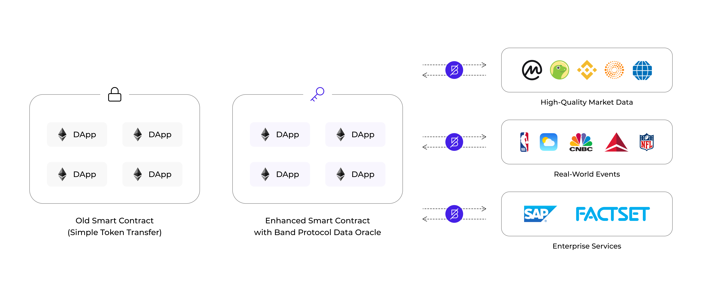
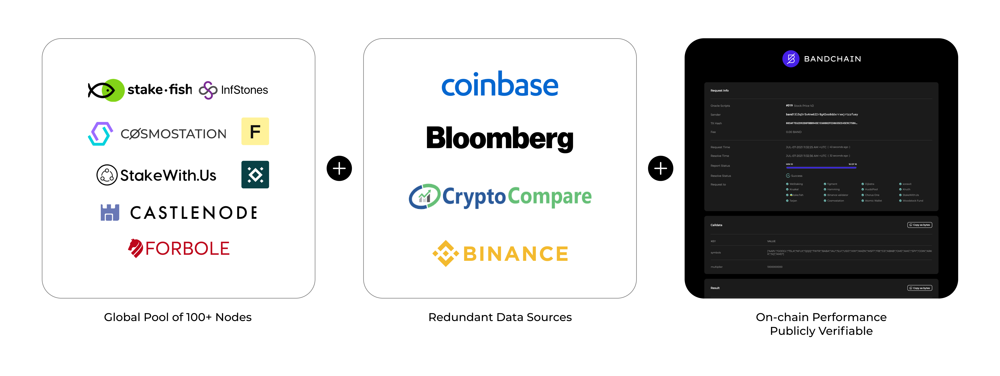
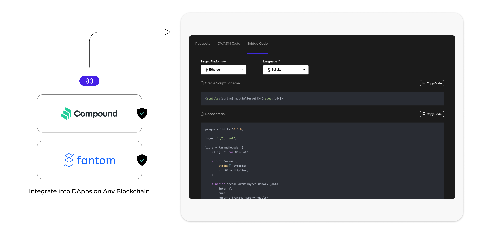
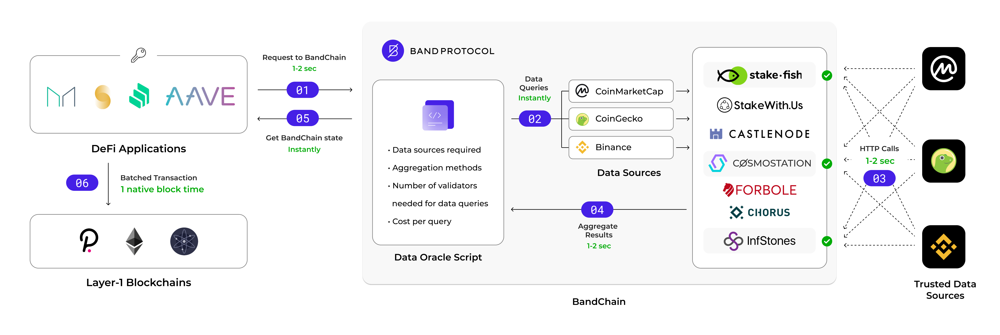
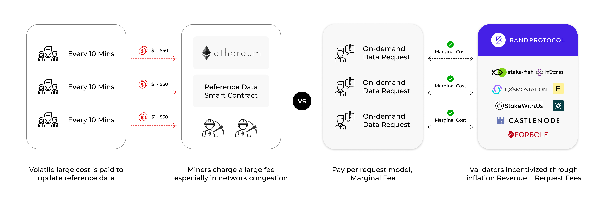

# The BandChain Oracle

The BandChain Oracle solution serves as an intermediary layer that operates between smart contract platforms or decentralized applications and various data providers.

The primary function of the oracles is as follows:

1. Responding to data requests from dApps
2. Querying data from the corresponding providers, and
3. Reporting results back to the application.
4. 

BandChain Oracle stands out from other oracle solutions in four key areas:

1. **Decentralization**: Our solution is built on a decentralized network of validators, ensuring that data is secure and transparent.
2. **Flexibility**: BandChain Oracle supports a wide range of data sources and formats, making it easy to integrate with existing systems.
3. **Scalability**: Our solution is designed to handle high volumes of data requests, ensuring that your business can grow and scale without interruption.
4. **Cost**: Users can request data only when they need to and pay the associated fees on a per-request basis, making it significantly more cost-effective than updating the price of an entire set of assets when only the latest price of one is needed

## Decentralization

BandChain Oracle is designed with maximum redundancy in its infrastructure to ensure decentralization at both the consensus and data source level.

To achieve this, BandChain is operated by a globally distributed pool of validators whose actions can be easily monitored and verified by anyone. When a data request is made, validators are responsible for fetching the results.

To provide an additional layer of redundancy, the results are taken from multiple data sources. BandChain's delegated proof of stake design also ensures that validators have monetary incentives to properly and accurately report data, or risk losing capital and reputation.

Moreover, the entire data request flow is publicly available for viewing, verification, and auditing by anyone.

## Flexibility

BandChain offers maximum customization and flexibility to its users through its data source and oracle scripts. These scripts allow users to query and compute their desired data feed with ease.

Data source scripts are custom scripts that allow users to query data from their desired sources. This data can then be fed into oracle scripts, which report back with the desired data feed.

Oracle scripts are pieces of code that define the logic of the data request. These scripts specify two things:

- the set of data sources that validators query data from
- the method to aggregate the result from those data sources into the final result.

These scripts can be programmed in multiple programming languages and function similarly to smart contracts.

## Scalability

BandChain is designed specifically for oracle data requests and computations, which sets it apart from general-purpose blockchains.

This design results in several benefits, such as an average block time of just 3 seconds, compared to Ethereum's 10-15 seconds and Bitcoin's 10 minutes. As a result, data request transactions are received and resolved quickly.

Furthermore, BandChain is optimized for heavy oracle computations, allowing it to offload these computations from the requester's chain.

This optimization, coupled with the design of BandChain, means that an average data request to BandChain's oracle can be expected to resolve in under six seconds. This allows BandChain Oracle to continuously enhance its throughput capacity with the same base-level infrastructure.

With its own chain, the oracle core logic and operations do not need to be duplicated onto a new chain or App for each integration, making integration with DApps streamlined and scalable.

## Cost

In addition to its scalability, Band's oracle offers an economical approach to data requests. Users can request data only when they need to and pay the associated fees on a per-request basis, making it significantly more cost-effective than updating the price of an entire set of assets when only the latest price of one is needed.

