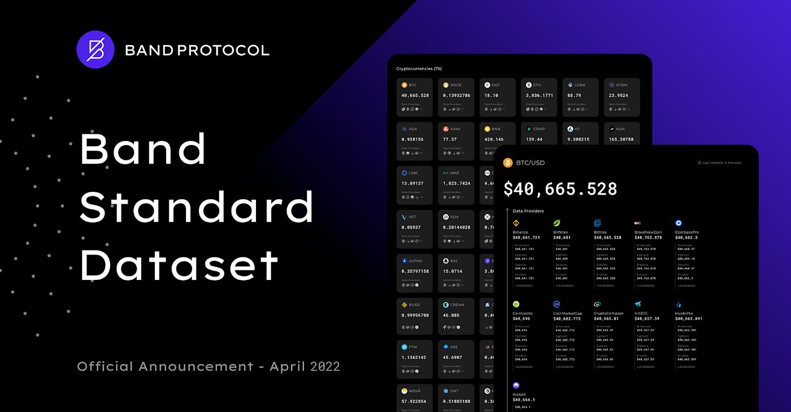

## Overview

[Band Standard Dataset](https://data.bandprotocol.com), an exhaustive reference price dataset with frequent updates and comprehensive, customizable feeds. With Band Standard Dataset is will help to connect your smart contracts to the real-world data with expansive support for crypto assets, commodities and foreign exchange rates.

The Band Standard Dataset provides aggregated data from various data sources through a decentralized network of independent node operators. The [Decentralized Data Model](/core-concepts/decentralized-validator-sampling) provides a detailed description of this process.

These Standard Dataset use cryptocurrencies price data aggregated from a number of premium data sources, including:

- [CoinGecko](https://coingecko.com)
- [CryptoCompare](https://cryptocompare.com)
- [CoinMarketCap](https://coinmarketcap.com)
- [Binance](https://binance.com)
- [Huobi Pro](https://www.huobi.com)
- [Coinbase Pro](https://pro.coinbase.com)
- [Bibox](https://www.bibox.com/en)
- [Bitfinex](https://www.bitfinex.com/)
- [Bittrex](https://global.bittrex.com/)
- [HitBTC](https://hitbtc.com/)
- [Kraken](https://www.kraken.com/)
- [OKX](https://www.okx.com/)

For the FX and commodity prices, we also aggregate data from premium sources:

- [Fixer](https://fixer.io)
- [Open Exchange Rates](https://openexchangerates.org/)
- [XE](https://xe.com)
- [AlphaVantage](https://www.alphavantage.co).

Data from these sources are retrieved by a subset of BandChain’s 71+ reputable validators and medianized on two layers, the validator and data provider level, which is then aggregated on BandChain into a single final result to be stored on the blockchain state. The data retrieval, aggregation, and storage process is transparent, publicly viewable, auditable, and verifiable through our [Cosmoscan](https://cosmoscan.io), our official block explorer for BandChain.

## Why Use Band Standard Dataset

#### Optimized for Efficiency and Cost-Effectiveness

Our Standard Dataset solutions are heavily optimized for gas usage, allowing developers to query multiple price pairs at once and retrieve accurate and reliable price updates for many feeds in the same block.

#### End-to-End Flexibility

In addition, developers can query any price pair, not just the standard `<TOKEN>/USD`, `<TOKEN>/BTC`, and `<TOKEN>/ETH` pairs. Price feeds can be paired against any of the 100+ feeds supported on the Band Standard Dataset, including pairs such as `BTC/USD`, `BTC/ETH`, `ETH/CNY`, `EUR/BTC`, and `DOT/ATOM`. This flexibility, combined with the ability to query multiple price pairs simultaneously, significantly reduces the engineering resources required for our feed users and ensures that the resulting code is simpler and less error-prone.

#### Constantly Increasing Diversity

BandChain's infrastructure is designed with full customizability, allowing for streamlined and faster support for new tokens or price data. This greatly benefits developers and protocols looking to support new or less-known tokens.

#### Over 100+ Secure Price Feeds Available for Developers

The [Standard Dataset](https://data.bandprotocol.com) currently offers over 100 asset price feeds, ranging from various cryptocurrency tokens to various foreign exchanges and commodities.

## Symbol Listing Criteria

Symbols listed on the Band Standard Dataset are those that have been verified and passed several criteria including, but not limited to:

1. Listed on at least 4 sources which are either aggregators or exchanges that are listed above.
2. For each centralized exchange source, the pair must be a reputable stablecoin pairing and maintain an average daily trading volume of $1,000,000 within the last 90 days.
3. For tokens listed and traded on DEXes, they must have a minimum liquidity of $10Mn.

The first criteria guarantees the robustness of our feed in the event that one of the sources is down and/or reports incorrect prices. We can rest assured that Band Oracle would still be able to provide accurate price feeds in a timely manner. The second criteria serves to minimise the possibility of prices being easily manipulated.

As of today, the Band Standard Dataset is composed of 88 cryptocurrencies, 25 foreign exchange rates, and 2 commodities. The Band Standard Dataset is our first-step in entrusting the Band Standard with our partners, be it data users developers, data providers as well as our validators.

By listing your symbol on the Band Standard dataset, you gain instant credibility and recognition within the blockchain community. Imagine the opportunities that await as your project becomes discoverable by thousands of users searching for reliable, verified data sources.

🔥 Don't miss out on the chance to amplify your project's visibility and reach 🔥

👉 Join us today at [Band Standard Dataset](https://data.bandprotocol.com) and take advantage of Band Protocol's Data Marketplace.

💪 Let's revolutionize the blockchain space together and unlock new possibilities for your symbol's success!
